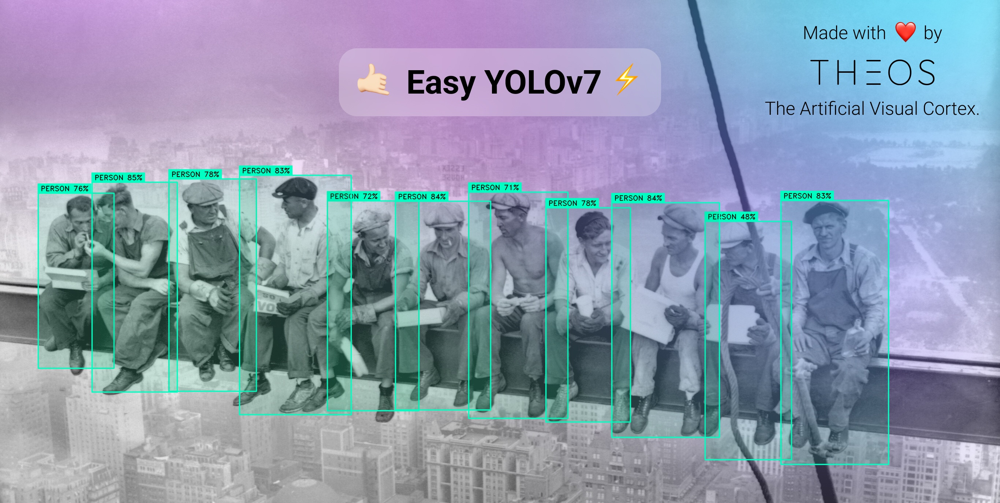
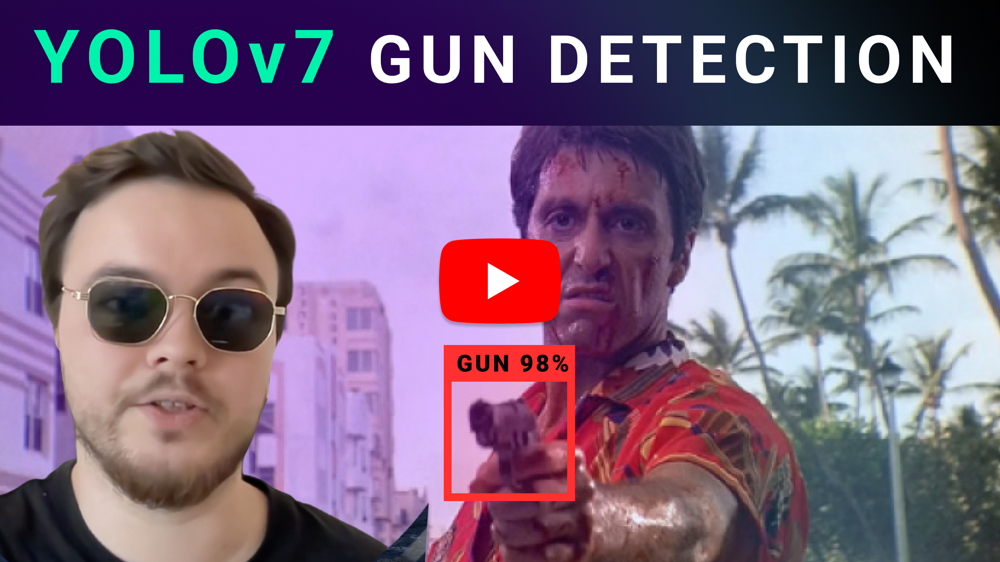
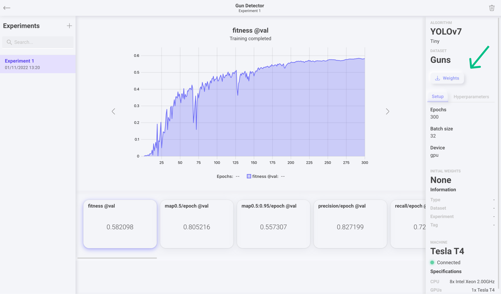

# 🤙🏻 Easy YOLOv7 ⚡️



This a clean and easy-to-use implementation of [YOLOv7](https://github.com/WongKinYiu/yolov7) in PyTorch, made with ❤️ by [Theos AI](https://theos.ai).

Don't forget to read our [Blog](https://blog.theos.ai) and subscribe to our [YouTube Channel](https://www.youtube.com/@theos-ai/)!

### Install all the dependencies
Always install the requirements inside a [virtual environment](https://docs.python.org/3/library/venv.html):
```
pip install -r requirements.txt
```
#### Fix dependencies
If you run into issues installing some dependencies, first make sure you installed them inside a virtual environment.
For cython-bbox, try installing it like this:
```
pip install -e git+https://github.com/samson-wang/cython_bbox.git#egg=cython-bbox
```

### Detect the image

```
python image.py
```

### Detect the webcam

```
python webcam.py
```

### Detect the video

```
python video.py
```

https://user-images.githubusercontent.com/14842535/204094120-8fc55f91-cc30-4097-9ad5-06f3cbc27b9c.mp4

### Detect multiple live video streams in parallel

Create a new text file called **streams.txt** inside the repository folder and put the URLs of the streams in each new line, for example:

```
https://192.168.0.203:8080/video
https://192.168.0.204:8080/video
https://192.168.0.205:8080/video
```

Then execute the streams script.

```
python streams.py
```

### Track the video

```
python track_video.py
```

### Track the webcam

```
python track_webcam.py
```

### Detect and OCR the image

```
python ocr_image.py
```


### Detect and OCR the video

This script uses a license plate recognition model (ANPR / ALPR), so you will have to edit it for it to work with your own model by changing the **weights** file, **classes** yaml file and finally the **ocr_classes** list.

```
python ocr_video.py
```

## Train YOLOv7 on your own custom dataset

Watch the following tutorial to learn how to do it.

[](https://www.youtube.com/watch?v=MorMkGS6_WU)

### Click the weights button

Go to your training experiment and click the weights button on the top right corner.



### Download the files

Download the best or last weights and the classes YAML file and put them inside the repository folder.


### Use your own custom model

Change the following line to use your custom model.

``` Python
yolov7.load('best.weights', classes='classes.yaml', device='cpu') # use 'gpu' for CUDA GPU inference
```

## Contact us

Reach out to [contact@theos.ai](mailto:contact@theos.ai) if you have any questions!
