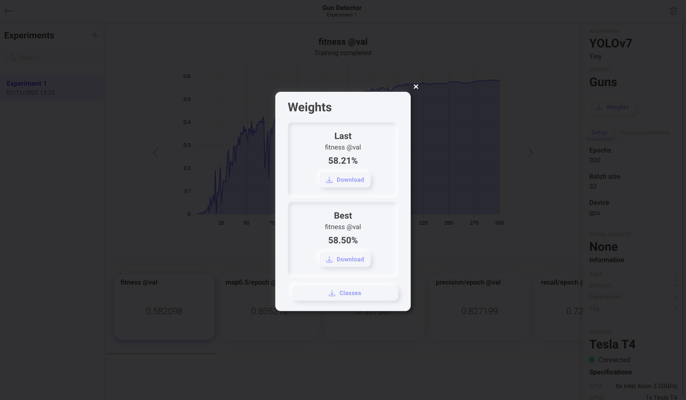

# 🤙🏻 Easy YOLOv7 ⚡️


This a clean and easy-to-use implementation of [YOLOv7](https://github.com/WongKinYiu/yolov7) in PyTorch, made with ❤️ by [Theos AI](https://theos.ai).

Don't forget to read our [Blog](https://blog.theos.ai) and subscribe to our [YouTube Channel](https://www.youtube.com/@theos-ai/)!

### Install all the dependencies

```
pip install -r requirements.txt
```

### Detect the image

```
python image.py
```

### Detect the webcam

```
python webcam.py
```

### Detect the video

```
python video.py
```

https://user-images.githubusercontent.com/14842535/204094120-8fc55f91-cc30-4097-9ad5-06f3cbc27b9c.mp4

## Train on your own custom dataset

[](https://www.youtube.com/watch?v=MorMkGS6_WU)

### Click the weights button


### Download the files
Download the best or last weights and the classes YAML file and put them inside this directory.



### Change this line to use your custom model

``` Python
yolov7.load('best.weights', classes='classes.yaml', device='cpu') # use 'gpu' for CUDA GPU inference
```